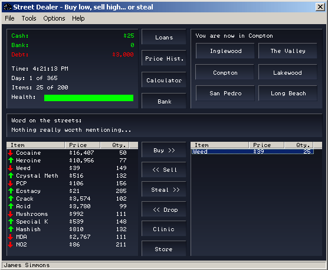



## Street Dealer 1\.0 \(DopeWars Clone\)

### Description

This is a pretty cool looking DopeWars clone based on the FoodWars program submited on this site a while back. Its nearly complete and has a tight interface. It basically demostrates basic encryption, the use of the RND function, and a couple other things that you might want to look through. Its well commented and is pretty simple and eay to follow. Have fun!
 
### More Info
 

             |
---                |---
**Submitted On**   |2002-02-18 16:21:28
**By**             |[neurokaotix](https://github.com/Planet-Source-Code/PSCIndex/blob/master/ByAuthor/neurokaotix.md)
**Level**          |Beginner
**User Rating**    |4.6 (23 globes from 5 users)
**Compatibility**  |VB 5\.0, VB 6\.0
**Category**       |[Games](https://github.com/Planet-Source-Code/PSCIndex/blob/master/ByCategory/games__1-38.md)
**World**          |[Visual Basic](https://github.com/Planet-Source-Code/PSCIndex/blob/master/ByWorld/visual-basic.md)
**Archive File**   |[Street\_Dea559982182002\.zip](https://github.com/Planet-Source-Code/neurokaotix-street-dealer-1-0-dopewars-clone__1-31911/archive/master.zip)

